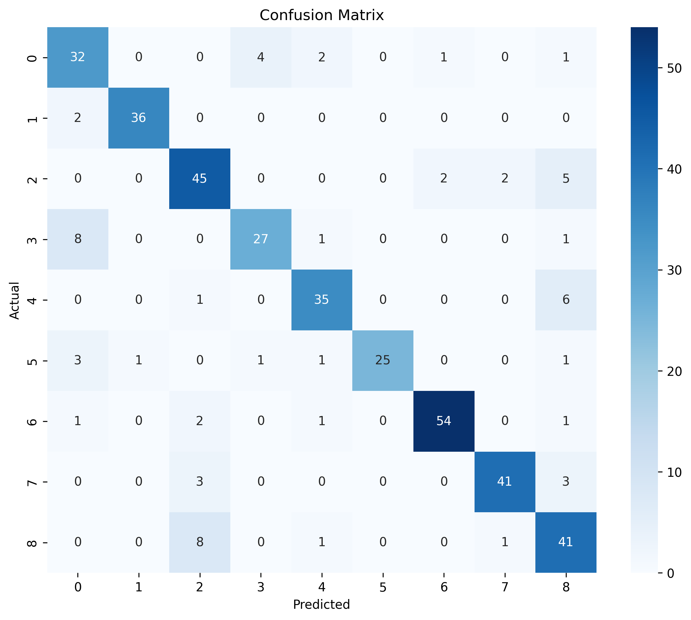

# Swin Transformer for Apple Leaf Disease Classification

This project implements a Swin Transformer model for classifying apple leaf diseases using PyTorch. It includes functionality for training with class balancing (oversampling/undersampling/weighted loss) and evaluating the model's performance.

## Project Structure

- **`main_swin_transformer.py`**: The main script for training and evaluating the Swin Transformer model.
- **`test_swin.ipynb`**: A Jupyter Notebook for testing the trained model and running inference on new images.
- **`swin_balanced_best.pth`** / **`best_swin_model_*.keras`**: Model checkpoints (PyTorch `.pth` and Keras `.keras` versions present).
- **`*confusion_matrix.png`**, **`output.png`**: Visualization of evaluation results.

## Requirements

The project uses PyTorch and the `timm` library for the Swin Transformer implementation.

Install the dependencies using:

```bash
pip install -r requirements.txt
```

**Key Dependencies:**
- `torch`, `torchvision` (Deep Learning framework)
- `timm` (PyTorch Image Models)
- `PyYAML` (Configuration handling)
- `scikit-learn` (Metrics like accuracy, confusion matrix)
- `matplotlib`, `seaborn` (Plotting)
- `tqdm` (Progress bars)

## Usage

### 1. Training

To train the model, use the `main_swin_transformer.py` script.

**Important:** Before running, you must open `main_swin_transformer.py` and verify/update the `data_dir` path in the `if __name__ == "__main__":` block at the bottom of the file:

```python
if __name__ == "__main__":
    # Configuration
    # UPDATE THIS PATH TO YOUR DATASET LOCATION
    data_dir = "/path/to/your/appleleaf/dataset"  
    
    # ...
```

Run the script:

```bash
python main_swin_transformer.py
```

The script will:
1.  Load the dataset from the specified directory (expecting `data.yaml` and standard YOLO/project structure).
2.  Apply class balancing (oversampling is default).
3.  Train a `swin_tiny_patch4_window7_224` model for 50 epochs.
4.  Save the best model as `swin_balanced_best.pth`.
5.  Generate training curves and confusion matrix plots.

### 2. Inference / Testing

You can use the `test_swin.ipynb` notebook to load a trained model and run inference.

1.  Open the notebook:
    ```bash
    jupyter notebook test_swin.ipynb
    ```
2.  Ensure the checkpoint path in the notebook matches your saved model (default: `swin/good_98/swin_balanced_best.pth`).
3.  Run the cells to predict classes for images.

## Model Details

*   **Architecture:** Swin Transformer (Tiny variant: `swin_tiny_patch4_window7_224`)
*   **Pretrained:** Yes (ImageNet)
*   **Input Size:** 224x224
*   **Features:**
    *   **Data Balancing:** Automatically handles imbalanced datasets using oversampling, undersampling, or weighted loss.
    *   **Augmentation:** Uses `RandomHorizontalFlip`, `RandomVerticalFlip`, `RandomRotation`, `ColorJitter`, and `RandomAffine` for robust training.

## Results

After training/evaluation, the script generates visualizations such as the confusion matrix to analyze model performance across different disease classes.



*(Note: Ensure the image file exists in the directory to view it)*
